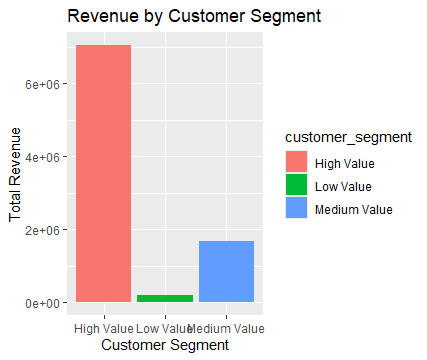
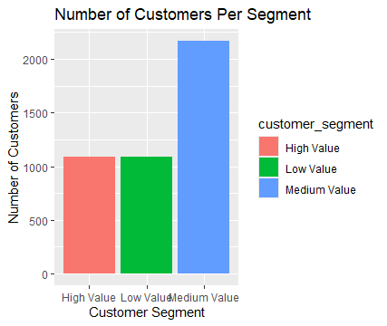
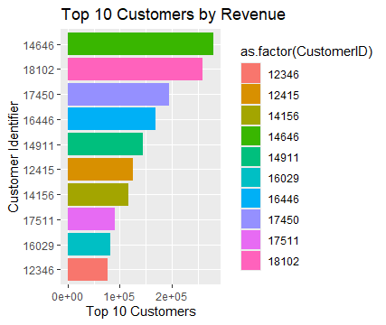

# Project Title
Customer Segmentation Analysis Using R

# Project Overview
This project presents a customer segmentation analysis using the Online Retail Dataset obtained from Kaggle. The objective of the analysis is to understand customer purchasing behaviour by grouping customers into meaningful segments based on their spending patterns and order activity.
The dataset contains transactional records from an online retail business, including customer identifiers, purchased products, quantities, prices, transaction dates, and customer locations. Using R programming, the project analyses customer-level revenue generation and purchasing frequency to identify high-value, medium-value, and low-value customer groups.
A key objective of this project is to transform raw transactional data into customer-level insights by engineering relevant business metrics such as total customer revenue, number of orders, average order value, and customer segment classification.
Using R libraries such as tidyverse, dplyr, and ggplot2, the project explores customer contribution patterns, segment distribution, and top-spending customers through analytical summaries and visualizations.
The insights generated from this analysis help businesses understand where revenue comes from, identify high-value customer groups, and build targeted retention and growth strategies to improve long-term profitability.

# Tools Used
•	R
•	tidyverse: For end-to-end data analysis workflow
•	dplyr: For data cleaning, grouping, and summarization
•	ggplot2: For data visualization
 
# Data Description
Source: Online Retail Dataset (CSV file obtained from Kaggle)
The dataset contains transactional records representing product purchases made by customers in an online retail business. Each row corresponds to a single purchased item within a transaction.

# Dataset Variables:
•	InvoiceNo: Unique transaction identifier
•	StockCode: Unique product code
•	Description: Product name or description
•	Quantity: Number of units purchased
•	InvoiceDate: Date and time of transaction
•	UnitPrice: Price per unit of product
•	CustomerID: Unique identifier for each customer
•	Country: Country where customer is located

# Engineered Variables (Created During Analysis)
To support customer segmentation analysis, new analytical variables were created:
•	Revenue: Total revenue generated per transaction (Quantity × UnitPrice)
•	total_revenue: Total revenue generated by each customer
•	number_of_orders: Total number of distinct orders placed by each customer
•	avg_order_value: Average amount spent per order by customer
•	customer_segment: Customer classification based on spending behavior:
•	High Value → Top 25% revenue customers 
•	Medium Value → Middle 50% revenue customers 
•	Low Value → Bottom 25% revenue customers 
These engineered features make it possible to analyse customer lifetime value patterns and segment business customers strategically.
 
# Data Cleaning
Before analysis, the dataset was cleaned to improve reliability and accuracy:
•	Removed rows with missing values in CustomerID and Description
•	Removed transactions where Quantity ≤ 0 (returns/cancellations)
•	Removed transactions where UnitPrice ≤ 0 (invalid pricing records)
•	Created a Revenue variable to calculate transaction-level revenue
•	Aggregated transactional records into customer-level summaries
•	Created customer segments using quantile-based revenue classification
•	Built summary datasets for visualization and segment comparison

# Business Questions
The analysis was guided by the following key business questions:
•	Which customer segment generates the highest total revenue?
•	Which segment contains the highest number of customers?
•	Who are the top-spending customers?
•	What does customer segmentation reveal about purchasing behaviour?
•	What business strategies can improve customer retention and revenue growth?

# Key Insights
•	High Value customers generated the largest share of total revenue, showing that a relatively smaller customer group contributes significantly to business income.
•	Medium Value customers represented the largest customer segment by population, making them the strongest growth opportunity for the business.
•	The Top 10 customers contributed exceptionally high revenue compared with the average customer, indicating a concentration of revenue among a small group of loyal customers.
•	Customer purchasing behaviour shows a classic segmentation pattern: a small percentage of customers drive large revenue, while a larger group contributes moderate revenue consistently.
•	Low-value customers represent a potential reactivation opportunity through targeted promotions and personalized offers.
 
# Visualization
Charts were created using ggplot2 to communicate findings visually: Bar Chart: Revenue by Customer Segment. Bar Chart: Number of Customers per Segment. Horizontal Bar Chart: Top 10 Customers by Revenue. 

This chart shows which customers bring in the most money. Most of the company’s revenue comes from High Value customers. The other two groups don’t contribute much.

This chart shows how many customers are in each group. Medium Value has the most customers, over 2,000 people, while High Value and Low Value have about the same number, each around 1,100 people.

This chart shows the top 10 customers and how much money each one brings in. Customer 14646 spends the most, close to 300k. After that, spending drops quickly. Customer 12346 at #10 spends under 100k. The top 2-3 customers bring in way more than the bottom ones.

These visualizations help clearly communicate revenue concentration, segment distribution, and customer value patterns.

# Conclusion 
The analysis shows that business revenue is heavily influenced by High Value customers, while Medium Value customers represent the largest customer base and provide strong opportunities for future revenue growth.

# Recommendation
Based on these findings, the business should consider the following strategies:
•	Retain High Value customers through loyalty rewards, exclusive offers, and personalized engagement strategies.
•	Convert Medium Value customers into High Value customers through upselling, product bundles, and targeted promotional campaigns.
•	Reactivate Low Value customers through discounts, remarketing campaigns, and personalized product recommendations.
•	Closely monitor top-spending customers, as retaining even a small number of these customers can significantly impact overall revenue performance.
These strategies can improve customer lifetime value, strengthen retention, and drive long-term business growth.

# Author
Franklin Chisom
Data Analyst | SQL, Python, Power BI, & R Programming Enthusiast
